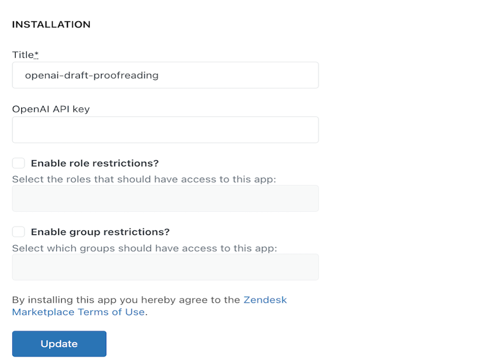
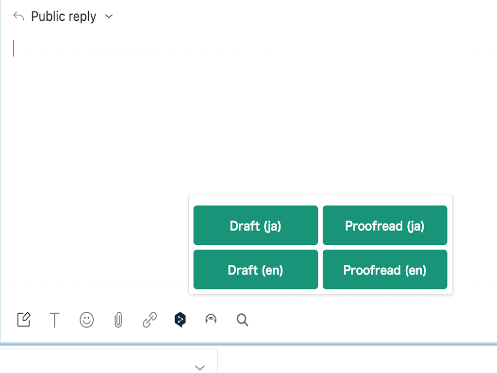
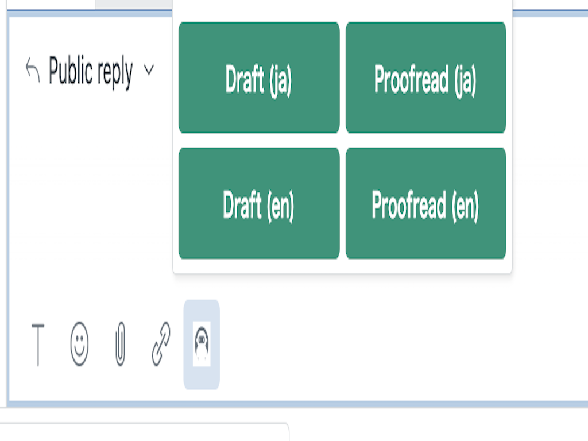

# Draft Proofreading OpenAI Assist

This Zendesk App (Draft Proofreading OpenAI Assist) helps Zendesk Agent to write and proofread a draft of your ticket response by using OpenAI.

### Prerequire

- [OpenAPI Paid APIKEY](https://platform.openai.com/account/api-keys)

### How to use

1. Install this app via Zendesk Marketplace
2. Set OpenAI's APIKEY in the app setting

3. In Zendesk Ticket view, select one of 4 options;

- Draft (ja): Send the ticket conversation to OpenAI and then insert the generated response in Japanese to the comment
- Proofread (en): Send a text in the ticket comment to OpenAI and then insert the reviewed response  in Japanese to the comment
- Draft (ja): Send the ticket conversation to OpenAI and then insert the generated response in English to the comment
- Proofread (en): Send a text in the ticket comment to OpenAI and then insert the reviewed response  in English to the comment

4. This app automatically inserts the response to the text box.

### How to access the OpenAI GPT-3 API

1. Visit the OpenAI website (https://www.openai.com/) and navigate to the API section
2. Create an OpenAI account if you don't already have one. This may involve providing necessary information, agreeing to terms of service, and potentially joining a waitlist or being placed in a queue for API access.
3. Familiarize yourself with the OpenAI Developer Dashboard, which is where you will manage your API access and obtain necessary credentials.
4. Once you have been granted access or your application has been approved, you will receive instructions on how to obtain your API key or access token. This key/token is a unique identifier that allows you to authenticate and make requests to the OpenAI API.

### License

This repository is licensed under the Apache 2.0 License.

